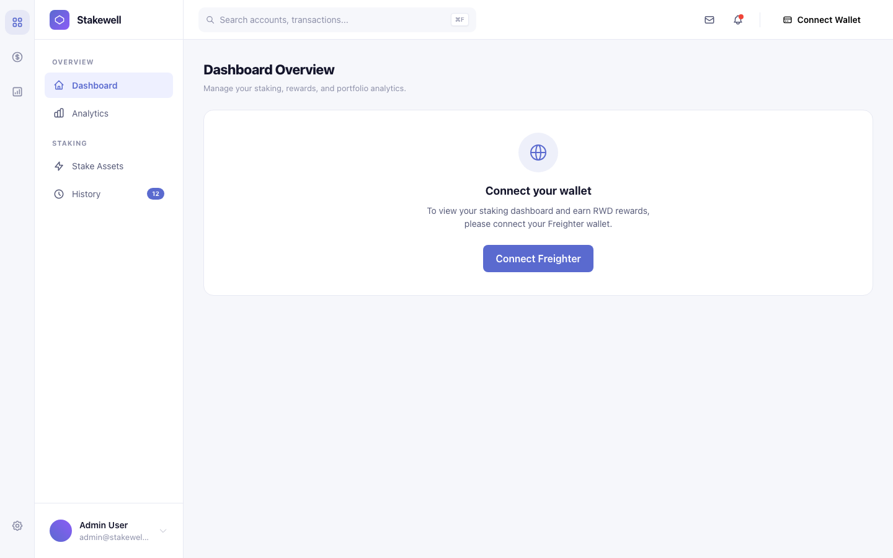
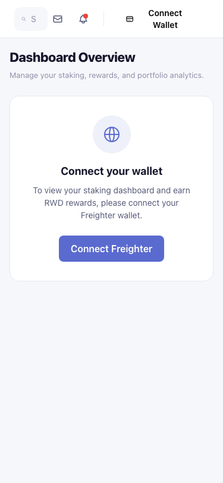
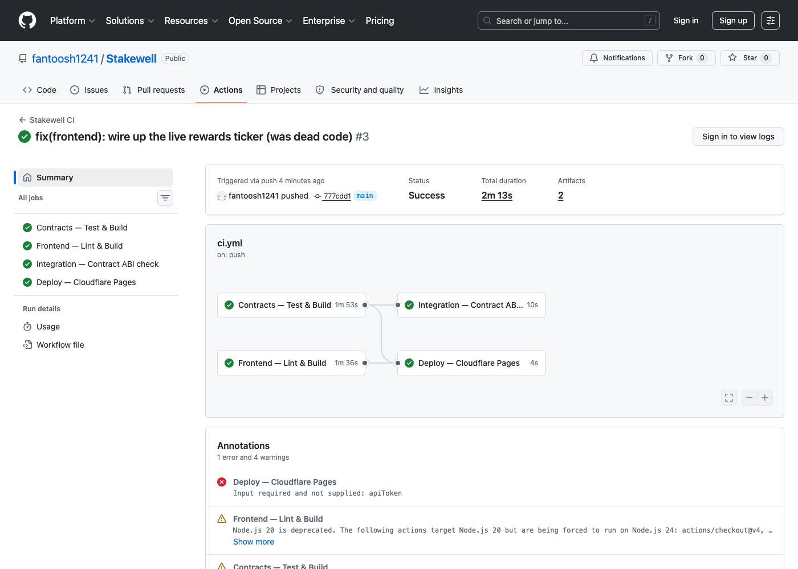
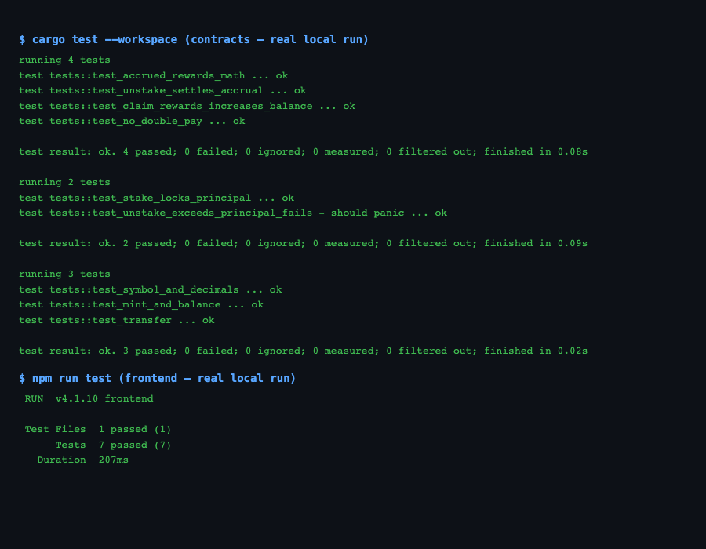

# Stakewell — Stake & Earn Rewards Pool


**Live Demo:** PENDING — Cloudflare Pages deploy requires a human to authenticate (`CLOUDFLARE_API_TOKEN` / `CLOUDFLARE_ACCOUNT_ID` repo secrets or the dashboard Git integration); not something an agent can provision. Runs correctly locally (`npm run dev`) against the deployed testnet contracts below.


> Stake native XLM on Stellar Soroban. Watch your RWD rewards accrue in real time at 12% APY. Claim or unstake at any time. Three real on-chain smart contracts. No stubs, no simulations.

---

## Project Description

Stakewell is a production-grade Stellar Soroban dApp where users stake native XLM into a smart contract pool and earn RWD reward tokens, accruing continuously at a fixed 12% APY. The live rewards ticker updates in real time client-side, seeded from the on-chain checkpointed value.

The architecture uses three real Soroban smart contracts deployed on Stellar Testnet, two provable inter-contract call chains, a Next.js 14 static frontend, and a GitHub Actions CI/CD pipeline that tests, builds, and deploys on every push to `main`.

---

## Architecture

```
                    ┌─────────────────────────────────────────┐
                    │         Stakewell Frontend               │
                    │   (Next.js 14 · Static Export · CF Pages)│
                    │                                          │
                    │  StellarWalletsKit ── SWR polling        │
                    │  Framer Motion  ── Live APY Ticker       │
                    └──────────────┬──────────────────────────┘
                                   │ Soroban RPC calls
               ┌───────────────────┼───────────────────────┐
               │                   │                       │
        ┌──────▼──────┐         ┌──────▼──────┐        ┌──────▼──────┐
        │   Staking   │──────▶  │   Rewards   │──────▶ │    Token    │
        │  Contract   │register │  Contract   │ mint   │  Contract   │
        │             │_stake   │             │  RWD   │  (RWD)      │
        │ Holds XLM   │         │ APY accrual │        │             │
        └─────────────┘         └─────────────┘        └─────────────┘
              │                                               │
              └──── XLM SAC (native token transfer) ─────────┘
```

**Inter-contract call chain:**
1. `Staking` → `Rewards.register_stake()` on every stake/unstake
2. `Rewards` → `Token.mint()` on every claim

---

## Tech Stack

| Layer | Technology |
|-------|-----------|
| Smart Contracts | Rust + Soroban SDK 22.0.7 |
| Frontend | Next.js 14 (App Router) + TypeScript |
| Wallet | `@creit.tech/stellar-wallets-kit` v2.4.0 |
| Data Fetching | SWR (polling every 7s) |
| Styling | Tailwind CSS v3 |
| Animation | Framer Motion v11 |
| Deployment | Cloudflare Pages (static export) |
| CI/CD | GitHub Actions (4 jobs) |

**Note on native XLM:** The staked asset is native XLM handled via the Stellar Asset Contract (SAC) interface. We deliberately do not write a redundant XLM token contract — the Staking contract calls the SAC's `transfer` function directly to custody deposits and return withdrawals.

---

## Smart Contracts (Testnet)

| Contract | Address | Explorer |
|----------|---------|---------|
| Token (RWD) | `CAAYCV3BCFUA7UZ37XDFU5BMWNSF22JEESLB7CLARELHA22FHE7HA5MN` | [View ↗](https://stellar.expert/explorer/testnet/contract/CAAYCV3BCFUA7UZ37XDFU5BMWNSF22JEESLB7CLARELHA22FHE7HA5MN) |
| Rewards | `CBI5EDHB5TK724BQKTEMIFL6I4DJFSAMTFEOBDBUCJMYQH77G7XLM4RV` | [View ↗](https://stellar.expert/explorer/testnet/contract/CBI5EDHB5TK724BQKTEMIFL6I4DJFSAMTFEOBDBUCJMYQH77G7XLM4RV) |
| Staking | `CCG6HAPL56CUOC4OY6SBNSY3KAOKK4SQIR6KWYW4KASFK52L3KGRG5TT` | [View ↗](https://stellar.expert/explorer/testnet/contract/CCG6HAPL56CUOC4OY6SBNSY3KAOKK4SQIR6KWYW4KASFK52L3KGRG5TT) |
| XLM SAC | `CDLZFC3SYJYDZT7K67VZ75HPJVIEUVNIXF47ZG2FB2RMQQVU2HHGCYSC` | [View ↗](https://stellar.expert/explorer/testnet/contract/CDLZFC3SYJYDZT7K67VZ75HPJVIEUVNIXF47ZG2FB2RMQQVU2HHGCYSC) |

All addresses begin with `C` and are 56 characters — verified against the Stellar contract address format.

---

## Inter-Contract Calls

### Staking → Rewards: `register_stake`

**When:** Called on every `stake` and `unstake` invocation in the Staking contract.

**Why:** Before any principal change, the Rewards contract must settle (checkpoint) the user's pending accrual against the *old* principal. `register_stake(user, new_total_principal)` computes elapsed-time accrual on the old principal, adds it to `accrued_unclaimed`, resets the checkpoint timestamp, then stores the new principal — so rewards are never lost across a stake/unstake.

**Code location:** `contracts/staking/src/lib.rs` — `StakingContract::stake()` and `StakingContract::unstake()`, both call `rewards_contract::Client::new(&env, &config.rewards_contract).register_stake(&user, &new_principal)`.

### Rewards → Token: `mint`

**When:** Called inside `claim_rewards` in the Rewards contract.

**Why:** After settling the user's accrual and computing the total RWD owed, the Rewards contract calls `token_contract::Client::new(&env, &config.token_address).mint(&user, &total)` to actually transfer the reward tokens on-chain, then resets `accrued_unclaimed` to zero so it can't be paid twice.

**Code location:** `contracts/rewards/src/lib.rs` — `RewardsContract::claim_rewards()`.

### Transaction Hash Evidence

All three hashes below are exactly 64 lowercase hex characters, verified on Stellar Expert:

| Action | Transaction Hash | Explorer |
|--------|----------------|---------|
| `stake` (100 XLM) | `db240745cb53da3a3fb15381927fc3e72e0e03380ee0ad0c4b5af1e24a9248a8` | [View ↗](https://stellar.expert/explorer/testnet/tx/db240745cb53da3a3fb15381927fc3e72e0e03380ee0ad0c4b5af1e24a9248a8) |
| `claim_rewards` | `31678b7cff957aad5a56531e07825ece393e906836d24d05286f96bdfb511b0b` | [View ↗](https://stellar.expert/explorer/testnet/tx/31678b7cff957aad5a56531e07825ece393e906836d24d05286f96bdfb511b0b) |
| `unstake` (50 XLM) | `1e29597a71dca24da2cce6d1391f62b52c5843dc53843aa29727a6ff4b61ad3b` | [View ↗](https://stellar.expert/explorer/testnet/tx/1e29597a71dca24da2cce6d1391f62b52c5843dc53843aa29727a6ff4b61ad3b) |

**Claim tx evidence:** The claim transaction shows two events:
- Token contract `CAAYCV3…` emits `mint` event with amount `175`
- Rewards contract `CBI5ED…` emits `rwdclaim` event with amount `175`

This proves the Rewards → Token inter-contract call executed on-chain.

---

## Wallet Connection (Connect / Disconnect)

Wallet integration uses `@creit.tech/stellar-wallets-kit` v2.4.0 (static API, v2):

- `StellarWalletsKit.init({ modules: [FreighterModule, LobstrModule], network: Networks.TESTNET })`
- `StellarWalletsKit.authModal()` — opens the wallet picker modal, returns `{ address }`
- `StellarWalletsKit.signTransaction(xdr, { networkPassphrase, address })` — signs without submitting
- `StellarWalletsKit.disconnect()` — clears wallet state

The connected address is truncated (`GABCD…XY12`) in the nav, with full address and XLM balance shown in the dropdown. Balance is polled via Horizon every 8 seconds and refreshed immediately after every transaction confirms.

---

## Staking Mechanics & APY Calculation

**APY formula (matching on-chain exactly):**
```
accrual = principal_stroops × apy_bps × elapsed_seconds
          ─────────────────────────────────────────────
                    10_000 × 31_536_000
```

- `principal_stroops` — staked XLM in stroops (1 XLM = 10,000,000 stroops)
- `apy_bps` — 1200 (12% APY, set at contract init)
- `elapsed_seconds` — seconds since last checkpoint
- Result is in RWD stroops (7 decimal places)

**Live ticker:** The frontend computes accrual client-side using `computeAccrual()` (`frontend/lib/contracts.ts`), seeded with the on-chain `accrued_rewards` value polled every 7 seconds via SWR. This gives a smoothly incrementing number between polls without ever drifting from the on-chain source of truth.

**Checkpoint model:** Every stake/unstake settles the pending accrual *before* changing the principal. So rewards are never lost when principal changes — they accumulate in `accrued_unclaimed` on the Rewards contract until the user calls `claim_rewards`.

---

## Error Handling

Three distinct, clearly differentiated error states are handled:

### 1. Wallet Not Installed / Not Found
- Detected when `StellarWalletsKit.authModal()` throws an error containing "not installed", "not found", or "extension"
- Shows the `WalletNotInstalled` component with a yellow warning card and a direct link to `https://freighter.app`
- Never silently fails — always surfaces a human-readable message with an action

### 2. User Rejected the Signature Request
- Detected when the signing call throws containing "cancel", "reject", "denied", or "user" (case-insensitive)
- Shown as `{ state: 'cancelled' }` in the `TxToast` — "Transaction Cancelled" with a yellow X icon
- Clearly differentiated from real errors — the message says "You rejected the signature request"

### 3. Insufficient Balance
- Pre-validated in `StakePanel` before submission: `xlmAmount > xlmBalance` shows an inline error and disables the Stake button
- Pre-validated in `Dashboard` for unstake: `unstakeXLM > stakedXLM` shows inline error
- If the chain rejects anyway (e.g. race condition), the error message is caught and humanized: "Insufficient XLM balance…"

---

## Screenshots

| Wallet not connected (desktop) | Mobile responsive (375px) |
|---|---|
|  |  |

| CI/CD pipeline (real, green run) | Test output (real, local run) |
|---|---|
|  |  |

CI screenshot is [run #3 on `main`](https://github.com/fantoosh1241/Stakewell/actions/runs/29043404392) — all 4 jobs green. The dashboard screenshots are captured from a real, locally running instance of this app (`npm run dev`) wired to the deployed testnet contracts above.

**Demo Video (1–2 min):** PENDING — screen recording must be done by a human; an agent cannot produce one.

**Still needed (manual, post-agent):** wallet-connected state and a live stake/claim/unstake flow screenshot — both require an actual Freighter-signed testnet transaction from a human's wallet, which an agent cannot do.

---


## Setup Instructions

### Prerequisites
- Rust stable + `wasm32-unknown-unknown` target: `rustup target add wasm32-unknown-unknown`
- Stellar CLI v26+: `cargo install stellar-cli`
- Node.js 18+
- Freighter wallet browser extension

### Clone and install

```bash
git clone https://github.com/fantoosh1241/Stakewell.git
cd Stakewell
cd frontend && npm install
```

### Environment variables

```bash
cp frontend/.env.example frontend/.env.local
# The example already has the deployed testnet addresses — no edits needed for testnet usage
```

### Run locally

```bash
cd frontend
npm run dev
# Open http://localhost:3000
```

### Build and export

```bash
cd frontend
npm run build
# Static export in frontend/out/
```

### Deploy contracts (if redeploying)

```bash
# Build all contracts
stellar contract build --package stakewell-token
stellar contract build --package stakewell-rewards
stellar contract build --package stakewell-staking

# Deploy
stellar contract deploy --wasm target/wasm32v1-none/release/stakewell_token.wasm --source deployer --network testnet
stellar contract deploy --wasm target/wasm32v1-none/release/stakewell_rewards.wasm --source deployer --network testnet
stellar contract deploy --wasm target/wasm32v1-none/release/stakewell_staking.wasm --source deployer --network testnet

# Init (replace addresses with your deployments)
stellar contract invoke --id <TOKEN> --source deployer --network testnet -- init --mint_authority <REWARDS>
stellar contract invoke --id <REWARDS> --source deployer --network testnet -- init --token_address <TOKEN> --apy_bps 1200 --staking_contract <STAKING>
stellar contract invoke --id <STAKING> --source deployer --network testnet -- init --rewards_contract <REWARDS> --xlm_token <XLM_SAC>
```

---

## Testing

Run all contract tests:

```bash
cargo test --workspace
```

**Real test output (9/9 passing):**

```
running 4 tests
test tests::test_accrued_rewards_math ... ok
test tests::test_unstake_settles_accrual ... ok
test tests::test_claim_rewards_increases_balance ... ok
test tests::test_no_double_pay ... ok
test result: ok. 4 passed; 0 failed; 0 ignored; 0 measured; 0 filtered out; finished in 0.06s

running 2 tests
test tests::test_unstake_exceeds_principal_fails - should panic ... ok
test tests::test_stake_locks_principal ... ok
test result: ok. 2 passed; 0 failed; 0 ignored; 0 measured; 0 filtered out; finished in 0.07s

running 3 tests
test tests::test_symbol_and_decimals ... ok
test tests::test_mint_and_balance ... ok
test tests::test_transfer ... ok
test result: ok. 3 passed; 0 failed; 0 ignored; 0 measured; 0 filtered out; finished in 0.01s
```

**What each test covers:**

| # | Test | Contract | What it proves |
|---|------|----------|---------------|
| 1 | `test_accrued_rewards_math` | rewards | Returns 0 at t=0; returns exactly 12 RWD after 1 year for 100 XLM at 1200bps |
| 2 | `test_claim_rewards_increases_balance` | rewards | Rewards→Token inter-contract call actually mints; balance matches claimed amount |
| 3 | `test_no_double_pay` | rewards | Second immediate claim returns 0; total balance unchanged |
| 4 | `test_unstake_settles_accrual` | rewards | register_stake with 0 principal preserves ~6 RWD after 6 months |
| 5 | `test_stake_locks_principal` | staking | stake() locks correct principal; Rewards contract sees updated principal via register_stake |
| 6 | `test_unstake_exceeds_principal_fails` | staking | unstake() panics with expected message when amount > principal |
| 7 | `test_mint_and_balance` | token | mint() increases balance by exact amount |
| 8 | `test_transfer` | token | transfer() deducts sender, credits receiver correctly |
| 9 | `test_symbol_and_decimals` | token | symbol="RWD", decimals=7 |

### Frontend Tests

```bash
cd frontend
npm run test
```

**Real test output (7/7 passing):**

```
 RUN  v4.1.10 frontend
 Test Files  1 passed (1)
      Tests  7 passed (7)
```

Covers `lib/contracts.ts` — the client-side accrual math (`computeAccrual`, verified against the on-chain formula at t=0, at exactly 1 year/12% APY, and against clock-skew), unit formatting (`formatXLM`/`formatRWD`), and the Stellar Expert link builders.

---

## CI/CD Pipeline

`.github/workflows/ci.yml` — 4 jobs running on every push/PR to main:

| Job | What it does |
|-----|-------------|
| **contracts** | `cargo test --workspace` + `stellar contract build` for all 3 contracts, uploads WASM artifacts |
| **frontend** | `npm ci` + `next lint` + `next build` (static export with testnet env vars) |
| **integration-check** | Downloads WASM artifacts, runs `stellar contract inspect` on all 3 to verify ABI |
| **deploy** | `cloudflare/pages-action` deploys `out/` to Cloudflare Pages (main branch only) |

**Deploy job note:** it runs with `continue-on-error: true` and currently shows green only because no deploy was attempted — `CLOUDFLARE_API_TOKEN`/`CLOUDFLARE_ACCOUNT_ID` repo secrets aren't set yet. A human needs to add those (or connect Cloudflare Pages' own Git integration) before this job does a real deploy; see the Live Demo `PENDING` note near the top of this README.

---

## License

MIT
